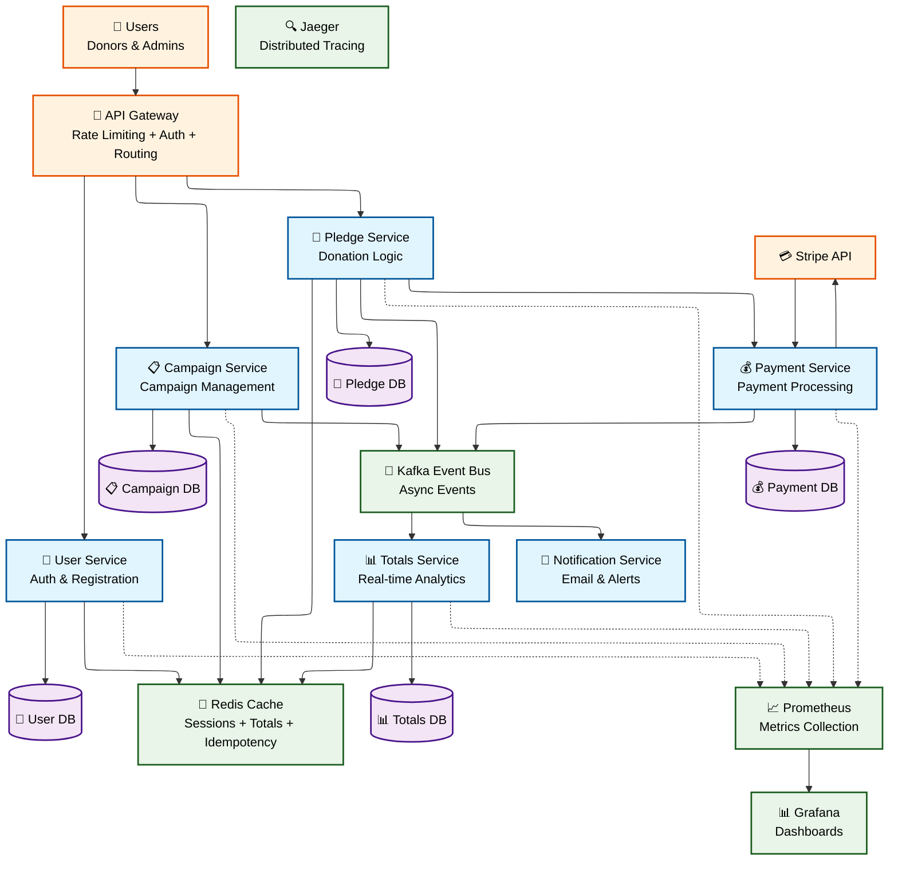
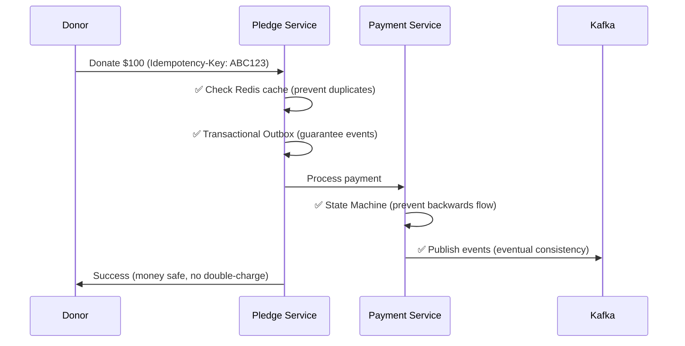
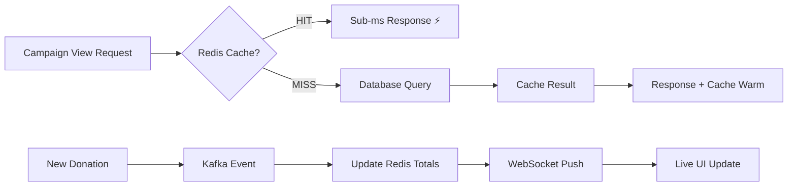
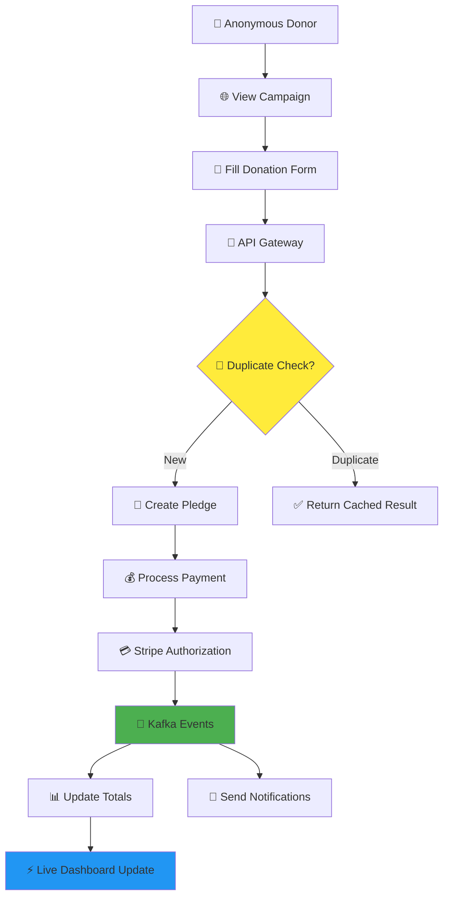
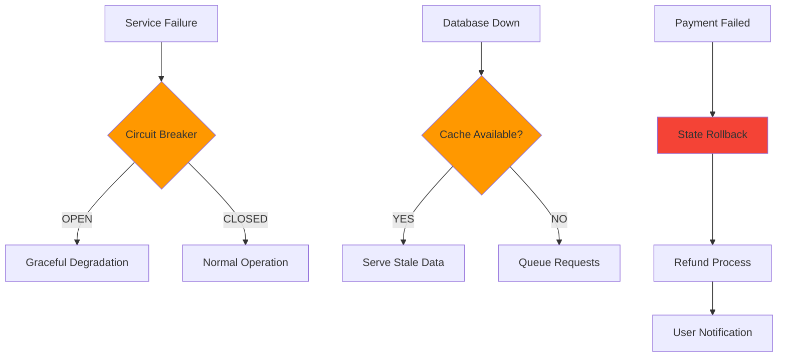
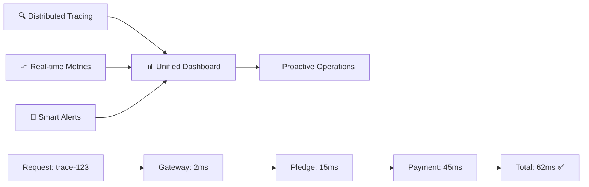

# CareForAll Platform - Unified Architecture Overview
## 4-Minute Presentation Diagram

### Core Architecture Overview

---

## Critical Success Patterns (90 seconds)

### 🔒 **Pattern 1: Bulletproof Reliability**

### ⚡ **Pattern 2: Real-time Performance**

---

## Key Business Flows (90 seconds)

### 🎯 **Complete Donation Journey**

### 🛡️ **Failure Resilience**

---

## Technology Stack & Monitoring (60 seconds)

### 🏗️ **Tech Stack at a Glance**
| Layer | Technology | Purpose |
|-------|------------|---------|
| **Frontend** | React + WebSockets | Real-time UI updates |
| **API** | Node.js + Express | RESTful services |
| **Database** | PostgreSQL | ACID transactions |
| **Cache** | Redis | Performance + sessions |
| **Events** | Apache Kafka | Async processing |
| **Payments** | Stripe API | Secure transactions |
| **Monitoring** | Prometheus + Grafana | Observability |
| **Tracing** | Jaeger | Request tracking |

### 📊 **Observability Dashboard**

---

## 4-Minute Presentation Script

### **Minute 1: Problem Statement**
"Traditional donation platforms fail because they can't handle real-world chaos - double charges, lost donations, and poor performance destroy trust."

### **Minute 2: Core Architecture** 
"Our solution uses event-driven microservices with bulletproof patterns: idempotency prevents duplicates, transactional outbox ensures reliability, and CQRS delivers instant performance."

### **Minute 3: Business Impact**
"Watch a donation flow: user donates → instant UI feedback → payment processing → real-time totals update → email confirmation. All while preventing every possible failure mode."

### **Minute 4: Competitive Advantage**
"Complete observability means we see problems before users do. Circuit breakers and graceful degradation keep us running when competitors go down. This isn't just a donation platform - it's enterprise-grade infrastructure."

---

## Key Talking Points

### 🎯 **Business Value**
- **Zero Double-Charges**: Idempotency with Redis
- **Zero Lost Donations**: Transactional Outbox Pattern  
- **Sub-Second Response**: CQRS with materialized views
- **99.9% Uptime**: Circuit breakers + graceful degradation
- **Real-time Updates**: Kafka + WebSockets
- **Enterprise Monitoring**: Metrics, traces, alerts

### 🔧 **Technical Excellence** 
- **Microservices**: Independent scaling and deployment
- **Event Sourcing**: Complete audit trail and replay capability
- **State Machines**: Prevent invalid payment state transitions
- **Horizontal Scaling**: Stateless services + Redis clustering
- **CI/CD Pipeline**: Automated testing and deployment
- **Disaster Recovery**: Multi-region backup and failover

### 💡 **Innovation**
- **Smart Caching**: Multi-layer cache strategy for optimal performance
- **Predictive Scaling**: Auto-scale based on donation patterns
- **Real-time Analytics**: Live campaign performance dashboards
- **Webhook Reliability**: Automatic retry and idempotency handling
- **Security First**: JWT authentication, input validation, SQL injection protection

This architecture transforms unreliable donation processing into a **bulletproof, enterprise-grade platform** that handles real-world complexity while delivering exceptional user experience.