# CareForAll - Visual Architecture Diagrams

## System Overview (High-Level)

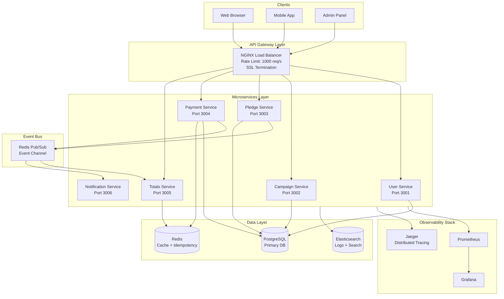

---

## Corner Case Solutions

### 1. Idempotency Pattern (Solves Double Charging)

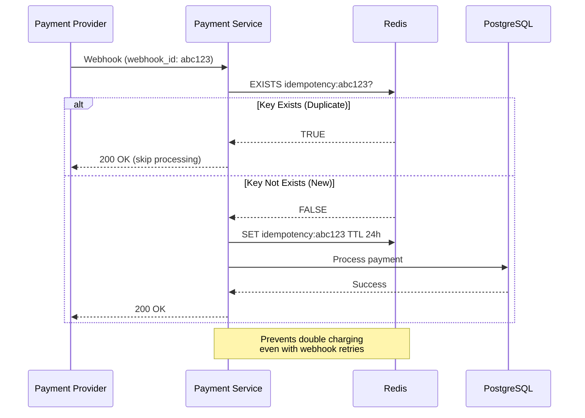

### 2. Transactional Outbox Pattern (Solves Lost Donations)

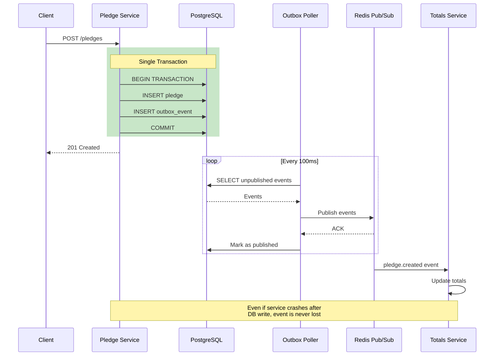

### 3. State Machine (Solves Out-of-Order Webhooks)

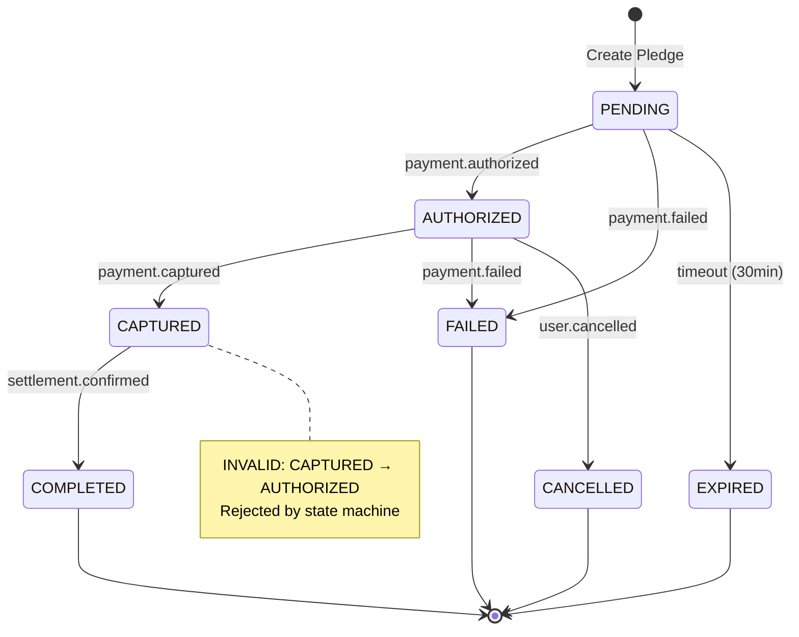

### 4. CQRS Pattern (Solves DB Overload on Totals)

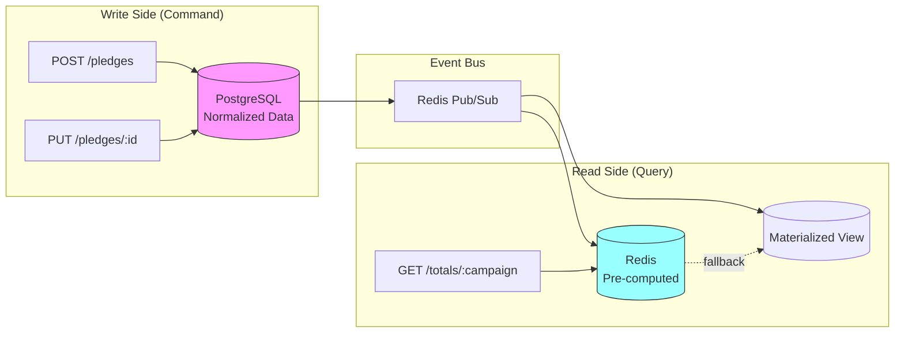

---

## Complete Donation Flow

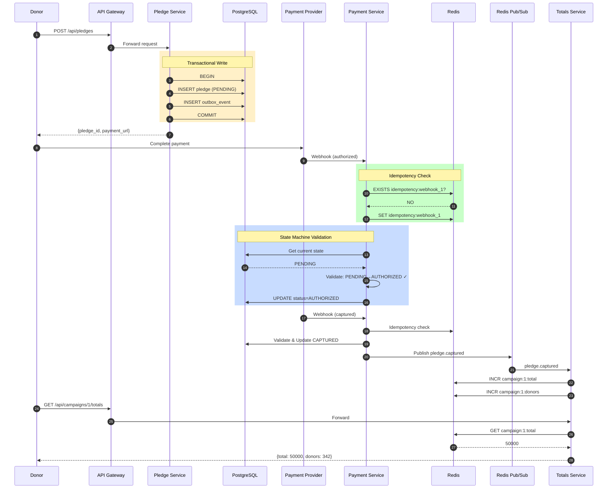

---

## Observability Architecture

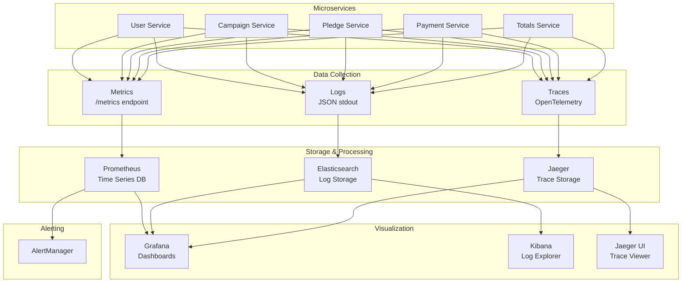

---

## Service Communication Patterns

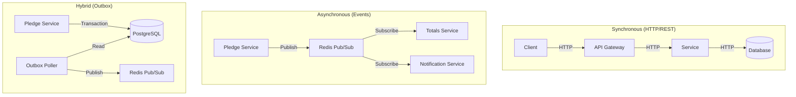

---

## Failure Recovery Patterns

```mermaid
flowchart TB
    subgraph Retry["Retry with Backoff"]
        R1[Attempt 1] -->|Fail| W1[Wait 1s]
        W1 --> R2[Attempt 2]
        R2 -->|Fail| W2[Wait 2s]
        W2 --> R3[Attempt 3]
        R3 -->|Fail| W3[Wait 4s]
        W3 --> R4[Attempt 4]
        R4 -->|Fail| DLQ[Dead Letter Queue]
    end

    subgraph Circuit["Circuit Breaker"]
        CLOSED[Closed<br/>Normal] -->|Failures > Threshold| OPEN[Open<br/>Fast Fail]
        OPEN -->|Timeout| HALF[Half-Open<br/>Test]
        HALF -->|Success| CLOSED
        HALF -->|Failure| OPEN
    end

    subgraph Fallback["Fallback Strategy"]
        PRIMARY[(Redis Cache)] -->|Miss| SECONDARY[(PostgreSQL)]
        SECONDARY -->|Error| DEFAULT[Default Response]
    end
```

---

## Docker Compose Service Map

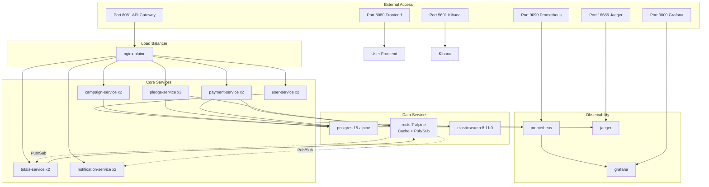

---

## Data Flow Summary

| Flow | Pattern | Why |
|------|---------|-----|
| Client → Service | REST via Gateway | Simple, cacheable |
| Service → DB | Transaction | ACID guarantees |
| DB → Event | Outbox Pattern | Reliability |
| Event → Consumer | Message Queue | Decoupling |
| Query → Cache | CQRS | Performance |
| Webhook → Service | Idempotent | Deduplication |
| State Change | State Machine | Correctness |

---

## Key Metrics to Monitor

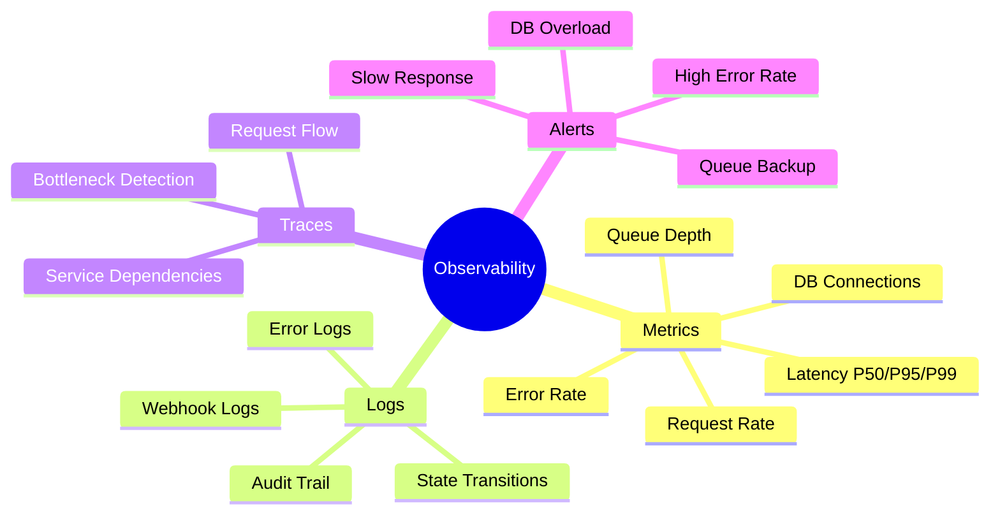

This architecture addresses all 6 critical failures from the original CareForAll system while maintaining simplicity and scalability.
