# CareForAll Platform - Complete System Flow Documentation

## Overview
This document describes the complete flow of operations in the CareForAll donation platform, including all service interactions, event flows, and failure handling mechanisms.

---

## 1. User Registration & Authentication Flow

### 1.1 User Registration
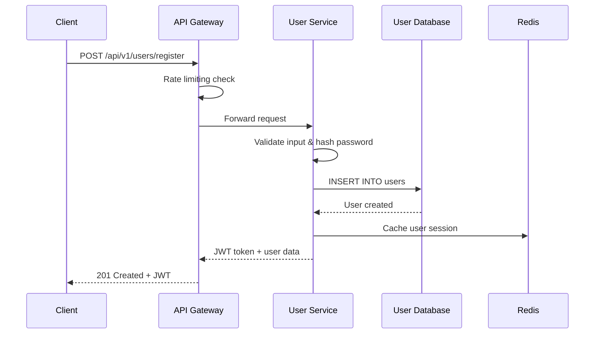
```mermaid
sequenceDiagram
    participant Client
    participant Gateway as API Gateway
    participant UserSvc as User Service
    participant UserDB as User Database
    participant Redis
    
    Client->>Gateway: POST /api/v1/users/register
    Gateway->>Gateway: Rate limiting check
    Gateway->>UserSvc: Forward request
    UserSvc->>UserSvc: Validate input & hash password
    UserSvc->>UserDB: INSERT INTO users
    UserDB-->>UserSvc: User created
    UserSvc->>Redis: Cache user session
    UserSvc-->>Gateway: JWT token + user data
    Gateway-->>Client: 201 Created + JWT
```

### 1.2 User Authentication
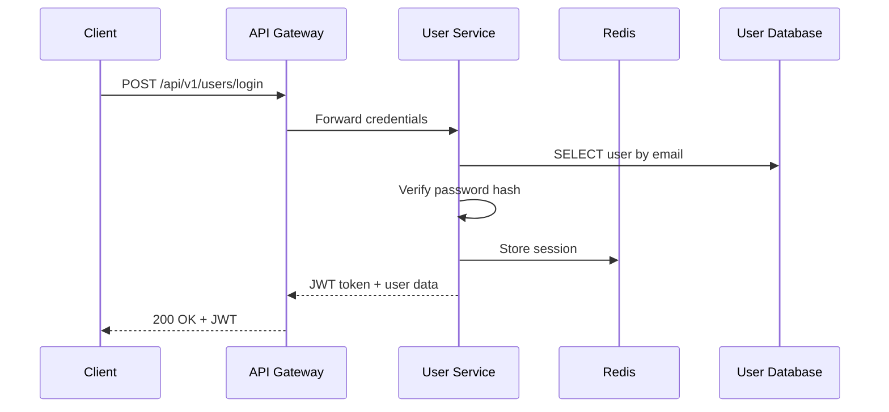
```mermaid
sequenceDiagram
    participant Client
    participant Gateway as API Gateway
    participant UserSvc as User Service
    participant Redis
    participant UserDB as User Database
    
    Client->>Gateway: POST /api/v1/users/login
    Gateway->>UserSvc: Forward credentials
    UserSvc->>UserDB: SELECT user by email
    UserSvc->>UserSvc: Verify password hash
    UserSvc->>Redis: Store session
    UserSvc-->>Gateway: JWT token + user data
    Gateway-->>Client: 200 OK + JWT
```

---

## 2. Campaign Management Flow

### 2.1 Create Campaign
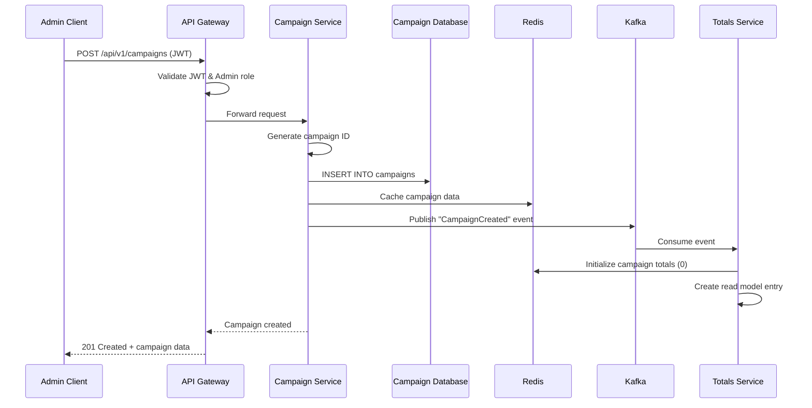
```mermaid
sequenceDiagram
    participant Admin as Admin Client
    participant Gateway as API Gateway
    participant CampaignSvc as Campaign Service
    participant CampaignDB as Campaign Database
    participant Redis
    participant Kafka
    participant TotalsSvc as Totals Service
    
    Admin->>Gateway: POST /api/v1/campaigns (JWT)
    Gateway->>Gateway: Validate JWT & Admin role
    Gateway->>CampaignSvc: Forward request
    CampaignSvc->>CampaignSvc: Generate campaign ID
    CampaignSvc->>CampaignDB: INSERT INTO campaigns
    CampaignSvc->>Redis: Cache campaign data
    CampaignSvc->>Kafka: Publish "CampaignCreated" event
    Kafka->>TotalsSvc: Consume event
    TotalsSvc->>Redis: Initialize campaign totals (0)
    TotalsSvc->>TotalsSvc: Create read model entry
    CampaignSvc-->>Gateway: Campaign created
    Gateway-->>Admin: 201 Created + campaign data
```

### 2.2 Get Campaign Details with Totals
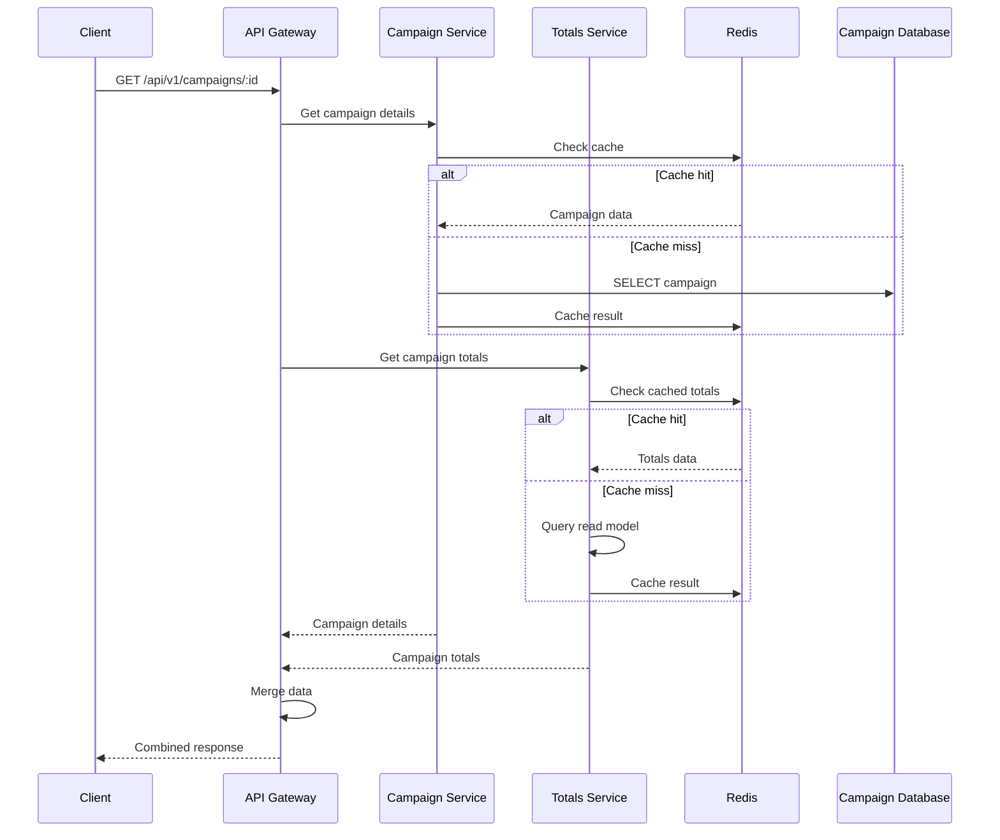
```mermaid
sequenceDiagram
    participant Client
    participant Gateway as API Gateway
    participant CampaignSvc as Campaign Service
    participant TotalsSvc as Totals Service
    participant Redis
    participant CampaignDB as Campaign Database
    
    Client->>Gateway: GET /api/v1/campaigns/:id
    Gateway->>CampaignSvc: Get campaign details
    CampaignSvc->>Redis: Check cache
    alt Cache hit
        Redis-->>CampaignSvc: Campaign data
    else Cache miss
        CampaignSvc->>CampaignDB: SELECT campaign
        CampaignSvc->>Redis: Cache result
    end
    
    Gateway->>TotalsSvc: Get campaign totals
    TotalsSvc->>Redis: Check cached totals
    alt Cache hit
        Redis-->>TotalsSvc: Totals data
    else Cache miss
        TotalsSvc->>TotalsSvc: Query read model
        TotalsSvc->>Redis: Cache result
    end
    
    CampaignSvc-->>Gateway: Campaign details
    TotalsSvc-->>Gateway: Campaign totals
    Gateway->>Gateway: Merge data
    Gateway-->>Client: Combined response
```

---

## 3. Complete Donation Flow (Core Business Logic)

### 3.1 Donation Request Processing
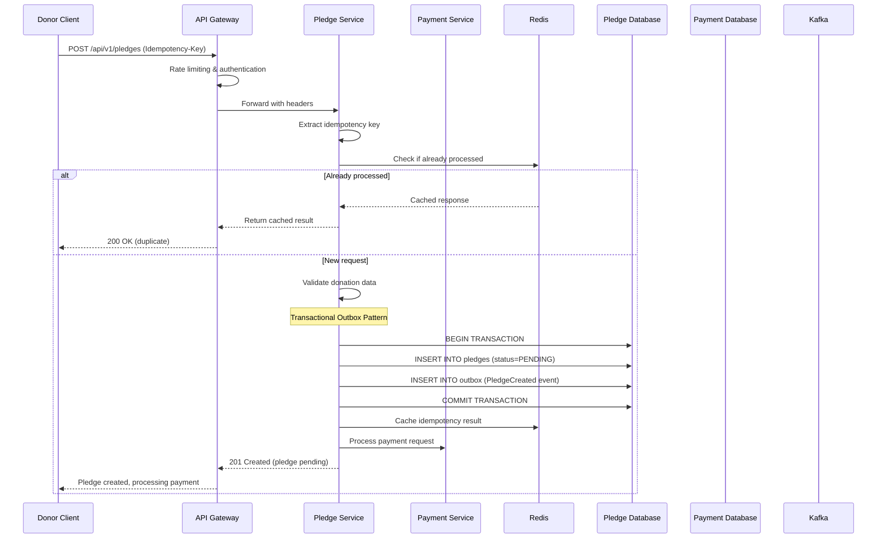
```mermaid
sequenceDiagram
    participant Donor as Donor Client
    participant Gateway as API Gateway
    participant PledgeSvc as Pledge Service
    participant PaymentSvc as Payment Service
    participant Redis
    participant PledgeDB as Pledge Database
    participant PaymentDB as Payment Database
    participant Kafka
    
    Donor->>Gateway: POST /api/v1/pledges (Idempotency-Key)
    Gateway->>Gateway: Rate limiting & authentication
    Gateway->>PledgeSvc: Forward with headers
    
    PledgeSvc->>PledgeSvc: Extract idempotency key
    PledgeSvc->>Redis: Check if already processed
    alt Already processed
        Redis-->>PledgeSvc: Cached response
        PledgeSvc-->>Gateway: Return cached result
        Gateway-->>Donor: 200 OK (duplicate)
    else New request
        PledgeSvc->>PledgeSvc: Validate donation data
        
        Note over PledgeSvc: Transactional Outbox Pattern
        PledgeSvc->>PledgeDB: BEGIN TRANSACTION
        PledgeSvc->>PledgeDB: INSERT INTO pledges (status=PENDING)
        PledgeSvc->>PledgeDB: INSERT INTO outbox (PledgeCreated event)
        PledgeSvc->>PledgeDB: COMMIT TRANSACTION
        
        PledgeSvc->>Redis: Cache idempotency result
        PledgeSvc->>PaymentSvc: Process payment request
        PledgeSvc-->>Gateway: 201 Created (pledge pending)
        Gateway-->>Donor: Pledge created, processing payment
    end
```

### 3.2 Payment Processing with State Machine
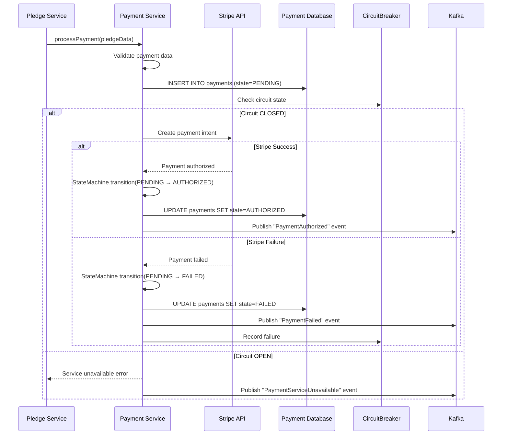
```mermaid
sequenceDiagram
    participant PledgeSvc as Pledge Service
    participant PaymentSvc as Payment Service
    participant StripeAPI as Stripe API
    participant PaymentDB as Payment Database
    participant CircuitBreaker
    participant Kafka
    
    PledgeSvc->>PaymentSvc: processPayment(pledgeData)
    PaymentSvc->>PaymentSvc: Validate payment data
    
    PaymentSvc->>PaymentDB: INSERT INTO payments (state=PENDING)
    PaymentSvc->>CircuitBreaker: Check circuit state
    
    alt Circuit CLOSED
        PaymentSvc->>StripeAPI: Create payment intent
        alt Stripe Success
            StripeAPI-->>PaymentSvc: Payment authorized
            PaymentSvc->>PaymentSvc: StateMachine.transition(PENDING → AUTHORIZED)
            PaymentSvc->>PaymentDB: UPDATE payments SET state=AUTHORIZED
            PaymentSvc->>Kafka: Publish "PaymentAuthorized" event
        else Stripe Failure
            StripeAPI-->>PaymentSvc: Payment failed
            PaymentSvc->>PaymentSvc: StateMachine.transition(PENDING → FAILED)
            PaymentSvc->>PaymentDB: UPDATE payments SET state=FAILED
            PaymentSvc->>Kafka: Publish "PaymentFailed" event
            PaymentSvc->>CircuitBreaker: Record failure
        end
    else Circuit OPEN
        PaymentSvc-->>PledgeSvc: Service unavailable error
        PaymentSvc->>Kafka: Publish "PaymentServiceUnavailable" event
    end
```

### 3.3 Webhook Processing (Critical for Reliability)
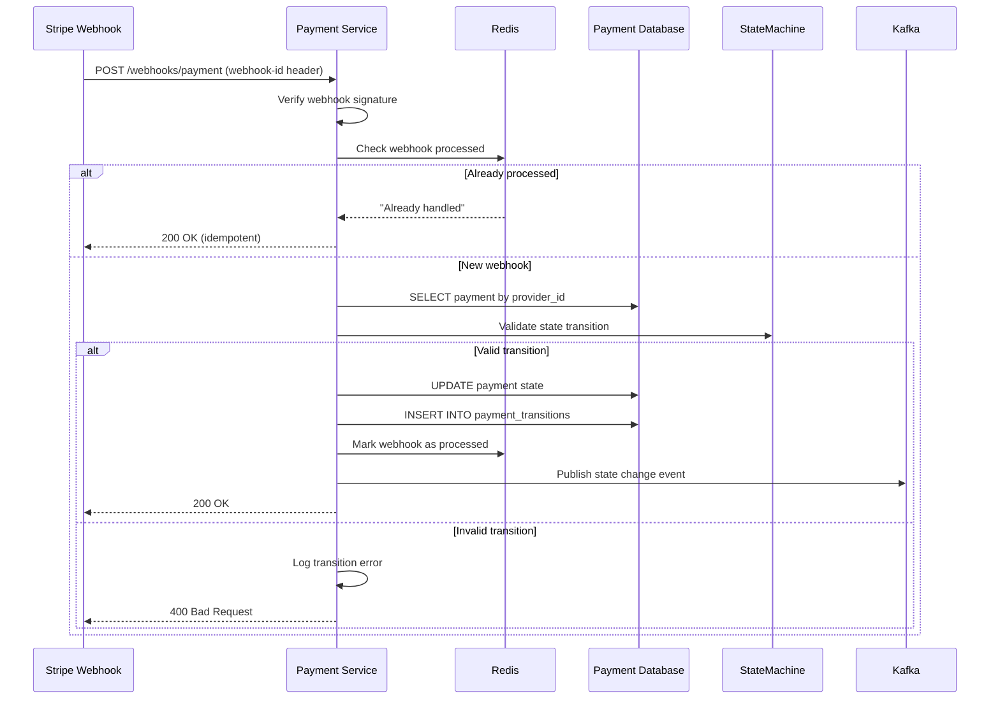
```mermaid
sequenceDiagram
    participant StripeWebhook as Stripe Webhook
    participant PaymentSvc as Payment Service
    participant Redis
    participant PaymentDB as Payment Database
    participant StateMachine
    participant Kafka
    
    StripeWebhook->>PaymentSvc: POST /webhooks/payment (webhook-id header)
    PaymentSvc->>PaymentSvc: Verify webhook signature
    
    PaymentSvc->>Redis: Check webhook processed
    alt Already processed
        Redis-->>PaymentSvc: "Already handled"
        PaymentSvc-->>StripeWebhook: 200 OK (idempotent)
    else New webhook
        PaymentSvc->>PaymentDB: SELECT payment by provider_id
        PaymentSvc->>StateMachine: Validate state transition
        
        alt Valid transition
            PaymentSvc->>PaymentDB: UPDATE payment state
            PaymentSvc->>PaymentDB: INSERT INTO payment_transitions
            PaymentSvc->>Redis: Mark webhook as processed
            PaymentSvc->>Kafka: Publish state change event
            PaymentSvc-->>StripeWebhook: 200 OK
        else Invalid transition
            PaymentSvc->>PaymentSvc: Log transition error
            PaymentSvc-->>StripeWebhook: 400 Bad Request
        end
    end
```

---

## 4. Event-Driven Updates (CQRS Pattern)

### 4.1 Outbox Event Publishing
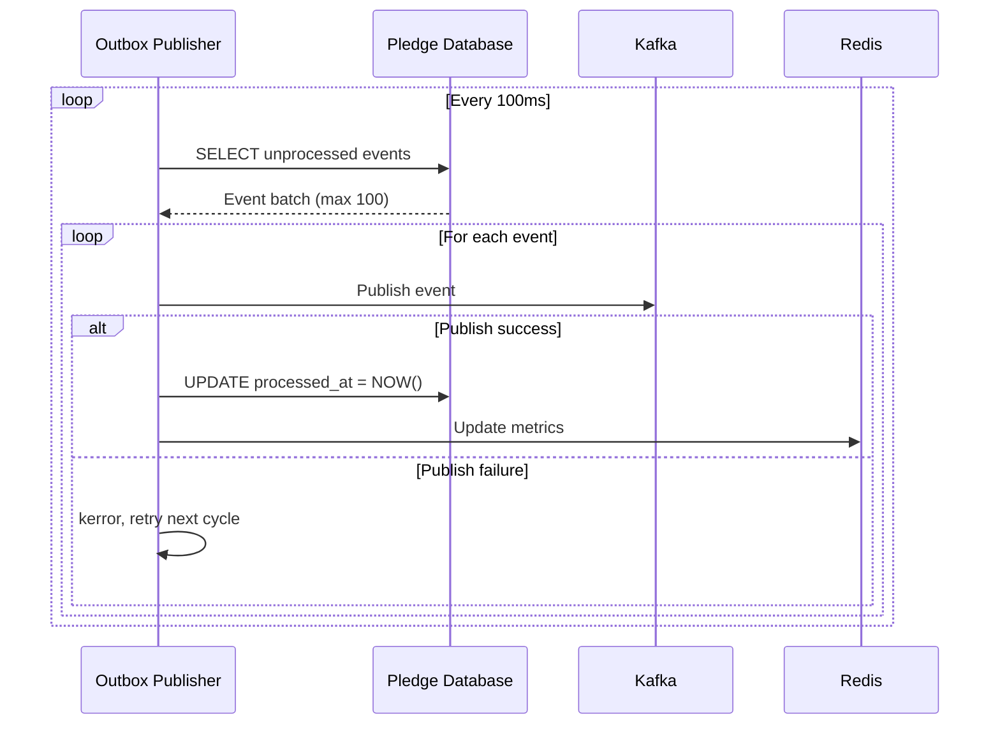
```mermaid
sequenceDiagram
    participant OutboxWorker as Outbox Publisher
    participant PledgeDB as Pledge Database
    participant Kafka
    participant Redis
    
    loop Every 100ms
        OutboxWorker->>PledgeDB: SELECT unprocessed events
        PledgeDB-->>OutboxWorker: Event batch (max 100)
        
        loop For each event
            OutboxWorker->>Kafka: Publish event
            alt Publish success
                OutboxWorker->>PledgeDB: UPDATE processed_at = NOW()
                OutboxWorker->>Redis: Update metrics
            else Publish failure
                OutboxWorker->>OutboxWorker: kerror, retry next cycle
            end
        end
    end
```

### 4.2 Real-time Totals Update (Read Model)
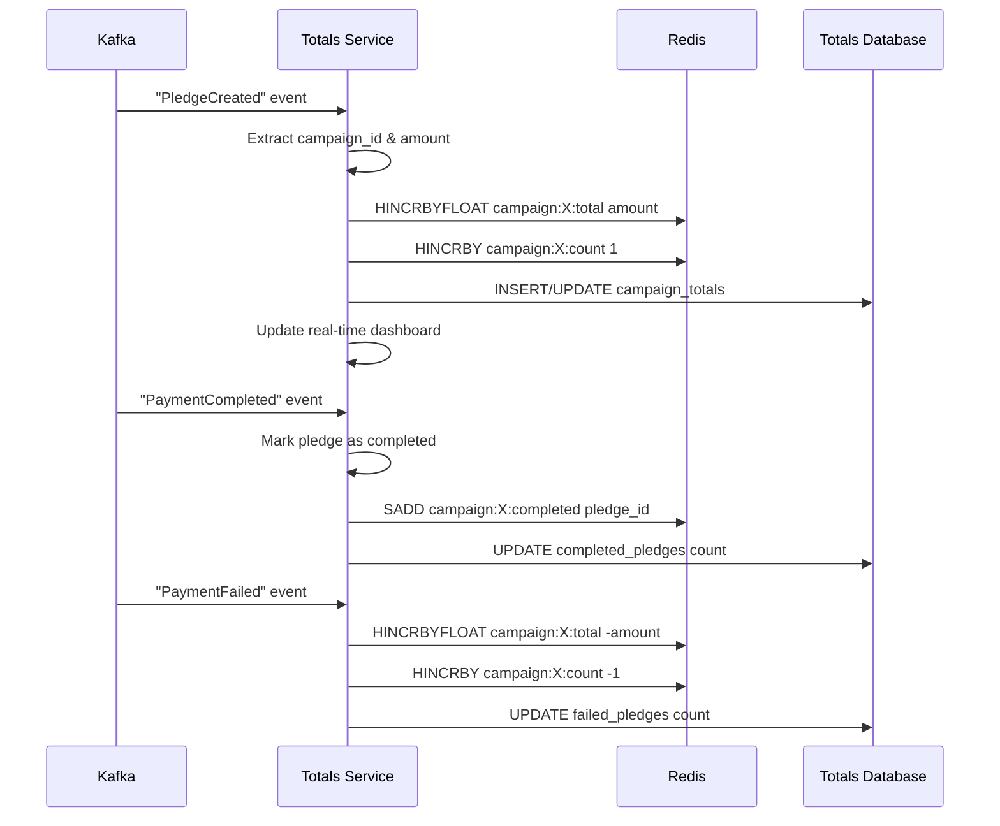
```mermaid
sequenceDiagram
    participant Kafka
    participant TotalsSvc as Totals Service
    participant Redis
    participant TotalsDB as Totals Database
    
    Kafka->>TotalsSvc: "PledgeCreated" event
    TotalsSvc->>TotalsSvc: Extract campaign_id & amount
    
    TotalsSvc->>Redis: HINCRBYFLOAT campaign:X:total amount
    TotalsSvc->>Redis: HINCRBY campaign:X:count 1
    
    TotalsSvc->>TotalsDB: INSERT/UPDATE campaign_totals
    TotalsSvc->>TotalsSvc: Update real-time dashboard
    
    Kafka->>TotalsSvc: "PaymentCompleted" event
    TotalsSvc->>TotalsSvc: Mark pledge as completed
    TotalsSvc->>Redis: SADD campaign:X:completed pledge_id
    TotalsSvc->>TotalsDB: UPDATE completed_pledges count
    
    Kafka->>TotalsSvc: "PaymentFailed" event
    TotalsSvc->>Redis: HINCRBYFLOAT campaign:X:total -amount
    TotalsSvc->>Redis: HINCRBY campaign:X:count -1
    TotalsSvc->>TotalsDB: UPDATE failed_pledges count
```

---

## 5. Complete User Journey: Anonymous Donation

### 5.1 End-to-End Anonymous Donation Flow
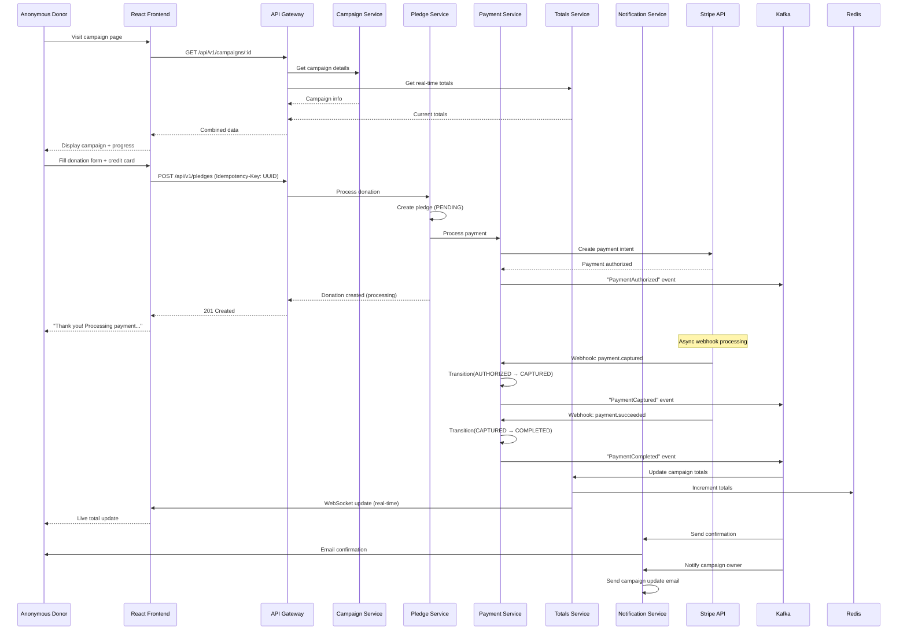
```mermaid
sequenceDiagram
    participant Donor as Anonymous Donor
    participant Frontend as React Frontend
    participant Gateway as API Gateway
    participant CampaignSvc as Campaign Service
    participant PledgeSvc as Pledge Service
    participant PaymentSvc as Payment Service
    participant TotalsSvc as Totals Service
    participant NotificationSvc as Notification Service
    participant StripeAPI as Stripe API
    participant Kafka
    participant Redis
    
    Donor->>Frontend: Visit campaign page
    Frontend->>Gateway: GET /api/v1/campaigns/:id
    Gateway->>CampaignSvc: Get campaign details
    Gateway->>TotalsSvc: Get real-time totals
    CampaignSvc-->>Gateway: Campaign info
    TotalsSvc-->>Gateway: Current totals
    Gateway-->>Frontend: Combined data
    Frontend-->>Donor: Display campaign + progress
    
    Donor->>Frontend: Fill donation form + credit card
    Frontend->>Gateway: POST /api/v1/pledges (Idempotency-Key: UUID)
    
    Gateway->>PledgeSvc: Process donation
    PledgeSvc->>PledgeSvc: Create pledge (PENDING)
    PledgeSvc->>PaymentSvc: Process payment
    PaymentSvc->>StripeAPI: Create payment intent
    StripeAPI-->>PaymentSvc: Payment authorized
    PaymentSvc->>Kafka: "PaymentAuthorized" event
    
    PledgeSvc-->>Gateway: Donation created (processing)
    Gateway-->>Frontend: 201 Created
    Frontend-->>Donor: "Thank you! Processing payment..."
    
    Note over StripeAPI: Async webhook processing
    StripeAPI->>PaymentSvc: Webhook: payment.captured
    PaymentSvc->>PaymentSvc: Transition(AUTHORIZED → CAPTURED)
    PaymentSvc->>Kafka: "PaymentCaptured" event
    
    StripeAPI->>PaymentSvc: Webhook: payment.succeeded
    PaymentSvc->>PaymentSvc: Transition(CAPTURED → COMPLETED)
    PaymentSvc->>Kafka: "PaymentCompleted" event
    
    Kafka->>TotalsSvc: Update campaign totals
    TotalsSvc->>Redis: Increment totals
    TotalsSvc->>Frontend: WebSocket update (real-time)
    Frontend-->>Donor: Live total update
    
    Kafka->>NotificationSvc: Send confirmation
    NotificationSvc->>Donor: Email confirmation
    
    Kafka->>NotificationSvc: Notify campaign owner
    NotificationSvc->>NotificationSvc: Send campaign update email
```

---

## 6. Failure Scenarios & Recovery

### 6.1 Payment Service Down (Circuit Breaker)
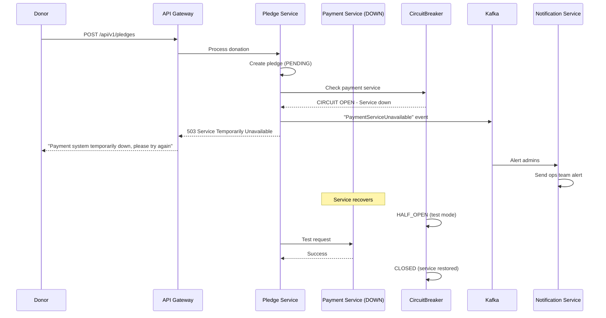
```mermaid
sequenceDiagram
    participant Donor
    participant Gateway as API Gateway
    participant PledgeSvc as Pledge Service
    participant PaymentSvc as Payment Service (DOWN)
    participant CircuitBreaker
    participant Kafka
    participant NotificationSvc as Notification Service
    
    Donor->>Gateway: POST /api/v1/pledges
    Gateway->>PledgeSvc: Process donation
    PledgeSvc->>PledgeSvc: Create pledge (PENDING)
    PledgeSvc->>CircuitBreaker: Check payment service
    CircuitBreaker-->>PledgeSvc: CIRCUIT OPEN - Service down
    
    PledgeSvc->>Kafka: "PaymentServiceUnavailable" event
    PledgeSvc-->>Gateway: 503 Service Temporarily Unavailable
    Gateway-->>Donor: "Payment system temporarily down, please try again"
    
    Kafka->>NotificationSvc: Alert admins
    NotificationSvc->>NotificationSvc: Send ops team alert
    
    Note over PaymentSvc: Service recovers
    CircuitBreaker->>CircuitBreaker: HALF_OPEN (test mode)
    PledgeSvc->>PaymentSvc: Test request
    PaymentSvc-->>PledgeSvc: Success
    CircuitBreaker->>CircuitBreaker: CLOSED (service restored)
```

### 6.2 Duplicate Donation (Idempotency Protection)
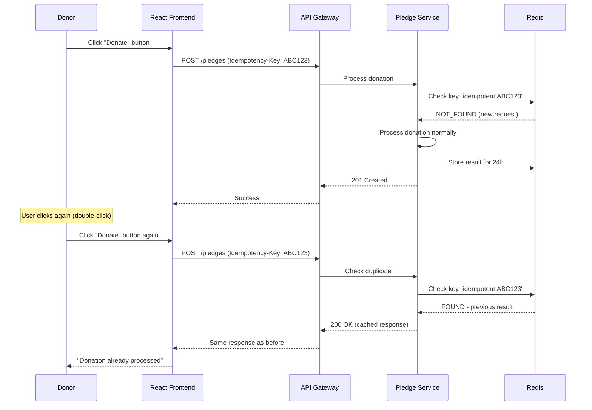
```mermaid
sequenceDiagram
    participant Donor
    participant Frontend as React Frontend
    participant Gateway as API Gateway
    participant PledgeSvc as Pledge Service
    participant Redis
    
    Donor->>Frontend: Click "Donate" button
    Frontend->>Gateway: POST /pledges (Idempotency-Key: ABC123)
    Gateway->>PledgeSvc: Process donation
    PledgeSvc->>Redis: Check key "idempotent:ABC123"
    Redis-->>PledgeSvc: NOT_FOUND (new request)
    PledgeSvc->>PledgeSvc: Process donation normally
    PledgeSvc->>Redis: Store result for 24h
    PledgeSvc-->>Gateway: 201 Created
    Gateway-->>Frontend: Success
    
    Note over Donor: User clicks again (double-click)
    Donor->>Frontend: Click "Donate" button again
    Frontend->>Gateway: POST /pledges (Idempotency-Key: ABC123)
    Gateway->>PledgeSvc: Check duplicate
    PledgeSvc->>Redis: Check key "idempotent:ABC123"
    Redis-->>PledgeSvc: FOUND - previous result
    PledgeSvc-->>Gateway: 200 OK (cached response)
    Gateway-->>Frontend: Same response as before
    Frontend-->>Donor: "Donation already processed"
```

### 6.3 Database Outage (Graceful Degradation)
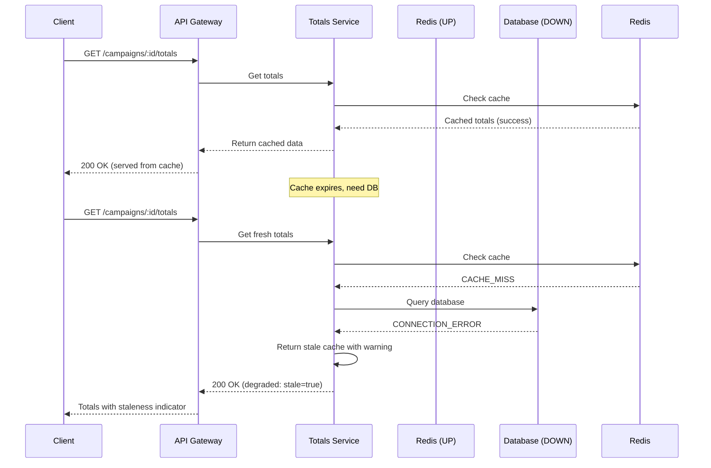
```mermaid
sequenceDiagram
    participant Client
    participant Gateway as API Gateway
    participant TotalsSvc as Totals Service
    participant Redis (UP)
    participant TotalsDB as Database (DOWN)
    
    Client->>Gateway: GET /campaigns/:id/totals
    Gateway->>TotalsSvc: Get totals
    TotalsSvc->>Redis: Check cache
    Redis-->>TotalsSvc: Cached totals (success)
    TotalsSvc-->>Gateway: Return cached data
    Gateway-->>Client: 200 OK (served from cache)
    
    Note over TotalsSvc: Cache expires, need DB
    Client->>Gateway: GET /campaigns/:id/totals
    Gateway->>TotalsSvc: Get fresh totals
    TotalsSvc->>Redis: Check cache
    Redis-->>TotalsSvc: CACHE_MISS
    TotalsSvc->>TotalsDB: Query database
    TotalsDB-->>TotalsSvc: CONNECTION_ERROR
    
    TotalsSvc->>TotalsSvc: Return stale cache with warning
    TotalsSvc-->>Gateway: 200 OK (degraded: stale=true)
    Gateway-->>Client: Totals with staleness indicator
```

---

## 7. Monitoring & Observability Flows

### 7.1 Distributed Tracing (Request Journey)
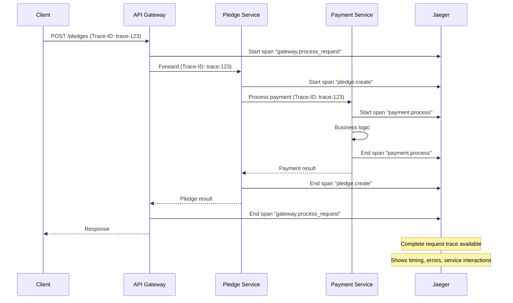
```mermaid
sequenceDiagram
    participant Client
    participant Gateway as API Gateway
    participant PledgeSvc as Pledge Service
    participant PaymentSvc as Payment Service
    participant Jaeger
    
    Client->>Gateway: POST /pledges (Trace-ID: trace-123)
    Gateway->>Jaeger: Start span "gateway.process_request"
    Gateway->>PledgeSvc: Forward (Trace-ID: trace-123)
    PledgeSvc->>Jaeger: Start span "pledge.create"
    PledgeSvc->>PaymentSvc: Process payment (Trace-ID: trace-123)
    PaymentSvc->>Jaeger: Start span "payment.process"
    PaymentSvc->>PaymentSvc: Business logic
    PaymentSvc->>Jaeger: End span "payment.process"
    PaymentSvc-->>PledgeSvc: Payment result
    PledgeSvc->>Jaeger: End span "pledge.create"
    PledgeSvc-->>Gateway: Pledge result
    Gateway->>Jaeger: End span "gateway.process_request"
    Gateway-->>Client: Response
    
    Note over Jaeger: Complete request trace available
    Note over Jaeger: Shows timing, errors, service interactions
```

### 7.2 Real-time Metrics & Alerting
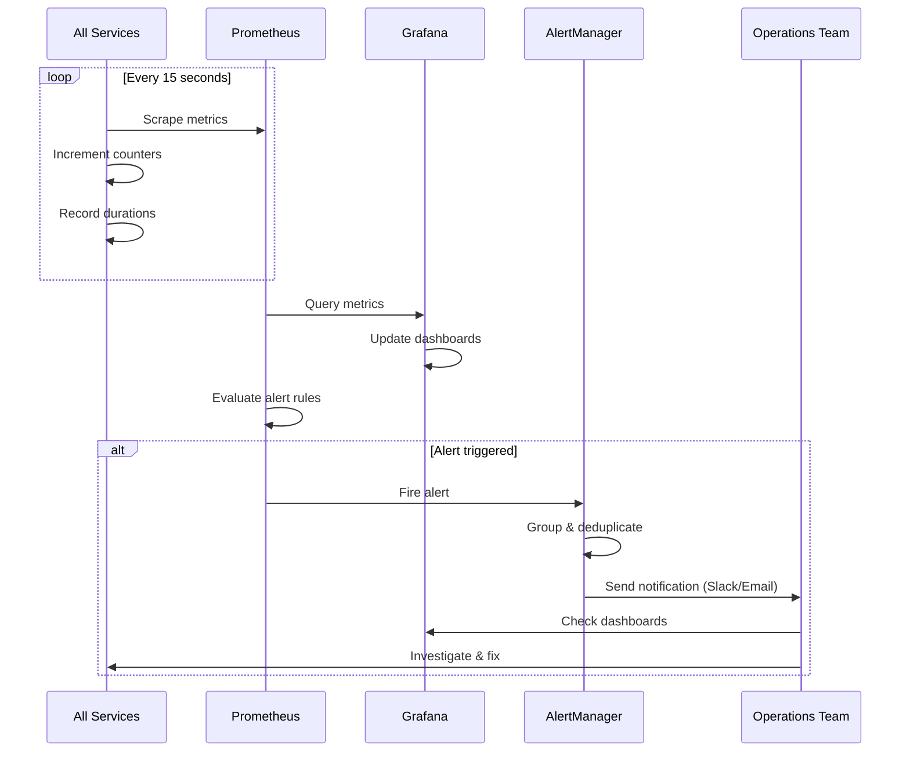
```mermaid
sequenceDiagram
    participant Services as All Services
    participant Prometheus
    participant Grafana
    participant AlertManager
    participant OpsTeam as Operations Team
    
    loop Every 15 seconds
        Services->>Prometheus: Scrape metrics
        Services->>Services: Increment counters
        Services->>Services: Record durations
    end
    
    Prometheus->>Grafana: Query metrics
    Grafana->>Grafana: Update dashboards
    
    Prometheus->>Prometheus: Evaluate alert rules
    alt Alert triggered
        Prometheus->>AlertManager: Fire alert
        AlertManager->>AlertManager: Group & deduplicate
        AlertManager->>OpsTeam: Send notification (Slack/Email)
        OpsTeam->>Grafana: Check dashboards
        OpsTeam->>Services: Investigate & fix
    end
```

---

## 8. Admin Operations Flow

### 8.1 Campaign Management Dashboard
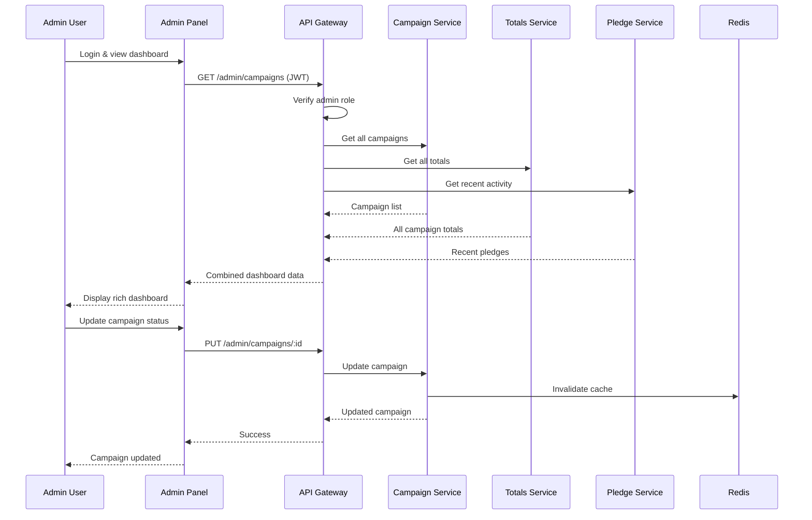
```mermaid
sequenceDiagram
    participant Admin as Admin User
    participant AdminPanel as Admin Panel
    participant Gateway as API Gateway
    participant CampaignSvc as Campaign Service
    participant TotalsSvc as Totals Service
    participant PledgeSvc as Pledge Service
    participant Redis
    
    Admin->>AdminPanel: Login & view dashboard
    AdminPanel->>Gateway: GET /admin/campaigns (JWT)
    Gateway->>Gateway: Verify admin role
    Gateway->>CampaignSvc: Get all campaigns
    Gateway->>TotalsSvc: Get all totals
    Gateway->>PledgeSvc: Get recent activity
    
    CampaignSvc-->>Gateway: Campaign list
    TotalsSvc-->>Gateway: All campaign totals
    PledgeSvc-->>Gateway: Recent pledges
    Gateway-->>AdminPanel: Combined dashboard data
    AdminPanel-->>Admin: Display rich dashboard
    
    Admin->>AdminPanel: Update campaign status
    AdminPanel->>Gateway: PUT /admin/campaigns/:id
    Gateway->>CampaignSvc: Update campaign
    CampaignSvc->>Redis: Invalidate cache
    CampaignSvc-->>Gateway: Updated campaign
    Gateway-->>AdminPanel: Success
    AdminPanel-->>Admin: Campaign updated
```

### 8.2 System Health Monitoring
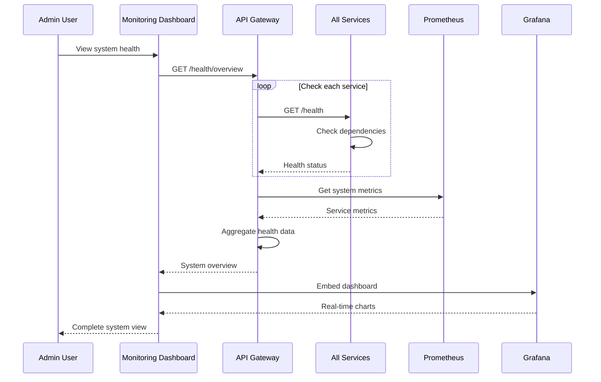
```mermaid
sequenceDiagram
    participant Admin as Admin User
    participant MonitoringUI as Monitoring Dashboard
    participant Gateway as API Gateway
    participant Services as All Services
    participant Prometheus
    participant Grafana
    
    Admin->>MonitoringUI: View system health
    MonitoringUI->>Gateway: GET /health/overview
    
    loop Check each service
        Gateway->>Services: GET /health
        Services->>Services: Check dependencies
        Services-->>Gateway: Health status
    end
    
    Gateway->>Prometheus: Get system metrics
    Prometheus-->>Gateway: Service metrics
    Gateway->>Gateway: Aggregate health data
    Gateway-->>MonitoringUI: System overview
    
    MonitoringUI->>Grafana: Embed dashboard
    Grafana-->>MonitoringUI: Real-time charts
    MonitoringUI-->>Admin: Complete system view
```

---

## 9. CI/CD Pipeline Flow

### 9.1 Automated Testing & Deployment
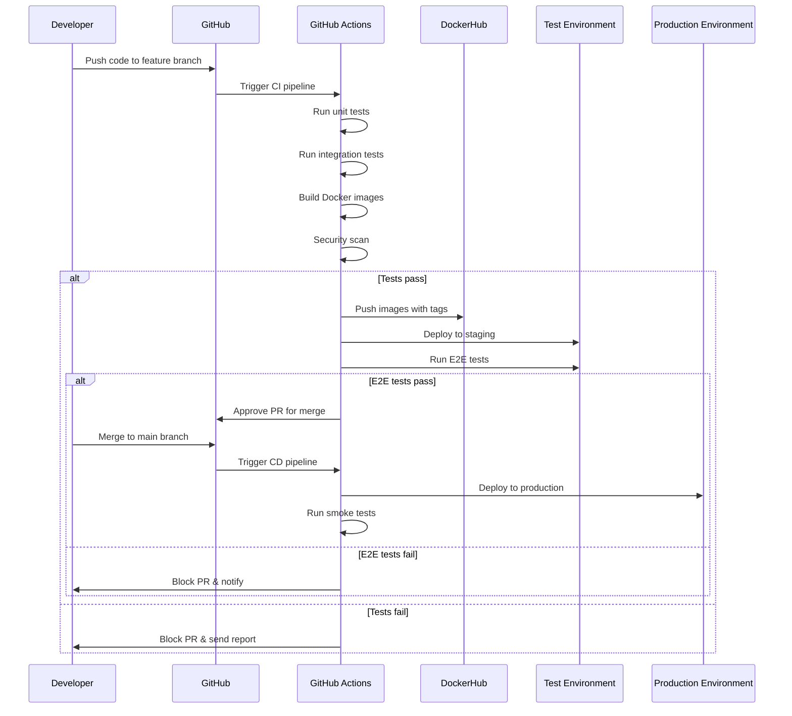
```mermaid
sequenceDiagram
    participant Developer
    participant GitHub
    participant GitHubActions as GitHub Actions
    participant DockerHub
    participant TestEnv as Test Environment
    participant ProdEnv as Production Environment
    
    Developer->>GitHub: Push code to feature branch
    GitHub->>GitHubActions: Trigger CI pipeline
    
    GitHubActions->>GitHubActions: Run unit tests
    GitHubActions->>GitHubActions: Run integration tests
    GitHubActions->>GitHubActions: Build Docker images
    GitHubActions->>GitHubActions: Security scan
    
    alt Tests pass
        GitHubActions->>DockerHub: Push images with tags
        GitHubActions->>TestEnv: Deploy to staging
        GitHubActions->>TestEnv: Run E2E tests
        
        alt E2E tests pass
            GitHubActions->>GitHub: Approve PR for merge
            Developer->>GitHub: Merge to main branch
            GitHub->>GitHubActions: Trigger CD pipeline
            GitHubActions->>ProdEnv: Deploy to production
            GitHubActions->>GitHubActions: Run smoke tests
        else E2E tests fail
            GitHubActions->>Developer: Block PR & notify
        end
    else Tests fail
        GitHubActions->>Developer: Block PR & send report
    end
```

---

## 10. Data Consistency & Recovery

### 10.1 Eventual Consistency Handling
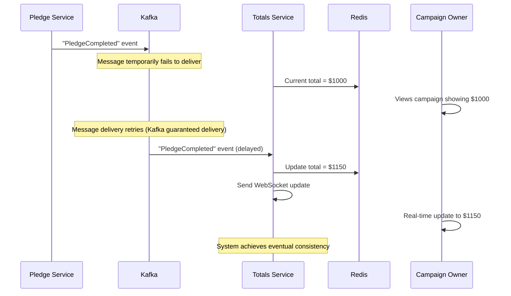
```mermaid
sequenceDiagram
    participant PledgeSvc as Pledge Service
    participant Kafka
    participant TotalsSvc as Totals Service
    participant Redis
    participant CampaignOwner as Campaign Owner
    
    PledgeSvc->>Kafka: "PledgeCompleted" event
    Note over Kafka: Message temporarily fails to deliver
    
    TotalsSvc->>Redis: Current total = $1000
    CampaignOwner->>CampaignOwner: Views campaign showing $1000
    
    Note over Kafka: Message delivery retries (Kafka guaranteed delivery)
    Kafka->>TotalsSvc: "PledgeCompleted" event (delayed)
    TotalsSvc->>Redis: Update total = $1150
    TotalsSvc->>TotalsSvc: Send WebSocket update
    CampaignOwner->>CampaignOwner: Real-time update to $1150
    
    Note over TotalsSvc: System achieves eventual consistency
```

### 10.2 Disaster Recovery Scenario
```mermaid
sequenceDiagram
    participant OpsTeam as Operations Team
    participant LoadBalancer as Load Balancer
    participant PrimaryDB as Primary Database
    parameter BackupDB as Backup Database
    participant Services as Application Services
    participant Redis
    
    Note over PrimaryDB: Database failure detected
    PrimaryDB->>PrimaryDB: Connection errors
    Services->>OpsTeam: Health check alerts
    
    OpsTeam->>LoadBalancer: Route traffic to backup region
    OpsTeam->>BackupDB: Promote to primary
    OpsTeam->>Services: Update connection strings
    Services->>BackupDB: Resume operations
    
    OpsTeam->>Redis: Clear stale cache
    Services->>Services: Warm up caches
    
    Note over Services: System restored with < 5min downtime
    OpsTeam->>OpsTeam: Begin primary DB recovery
```

---

## Summary: Why This Architecture Solves All Problems

### ✅ Problem Solved: Double Charging
**Solution**: Idempotency keys with Redis caching
**Flow**: Every request has unique ID → Check cache → Process or return cached result

### ✅ Problem Solved: Lost Donations  
**Solution**: Transactional Outbox Pattern
**Flow**: Single transaction writes data + event → Background worker publishes events

### ✅ Problem Solved: Backward State Transitions
**Solution**: Finite State Machine with validation
**Flow**: Strict state rules → Only valid transitions allowed → Log all changes

### ✅ Problem Solved: Performance Issues
**Solution**: CQRS with materialized views
**Flow**: Separate read/write models → Pre-calculated totals in Redis → Sub-ms responses

### ✅ Problem Solved: No Observability
**Solution**: Complete monitoring stack
**Flow**: Metrics → Logs → Traces → Alerts → Dashboards → Proactive monitoring

This architecture transforms a failing system into a **bulletproof, enterprise-grade platform** capable of handling real-world chaos while maintaining data consistency and providing excellent user experience.